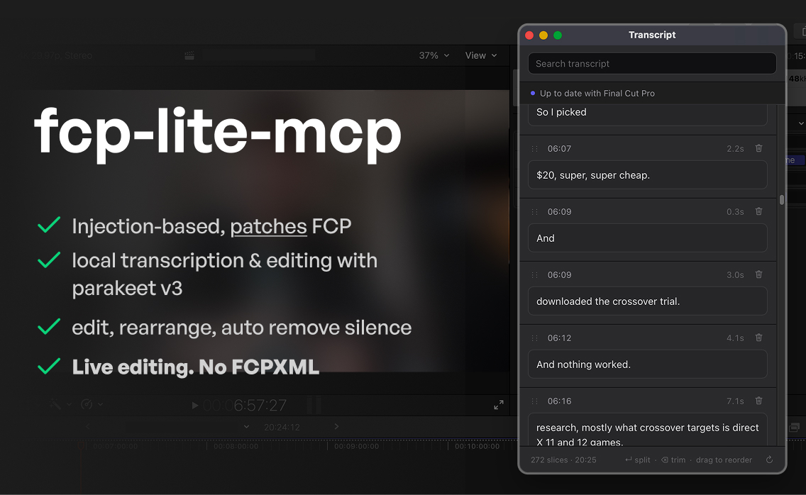

# fcp-mcp-lite



Lightweight MCP server for Final Cut Pro: **transcribe, cut, audit**. It drives a
patched FCP over a local JSON-RPC bridge — no Workflow Extension SDK, no
`.appex`, no private framework linking beyond the dylib the patcher injects.

It is a small rewrite built on [SpliceKit](https://github.com/elliotttate/SpliceKit)
(MIT) — its copy-→-inject-→-re-sign approach and bridge patterns were the
starting point, and only the load-bearing core was kept.

## Components

```
patch/patch_fcp.sh             copy → inject dylib → re-sign → launch
bridge/FCPBridge.m             ObjC dylib: TCP JSON-RPC 2.0 on 127.0.0.1:9876
                               + in-process Window > Transcript panel
mcp/server.py                  stdio MCP server (the verbs below) → TCP bridge
extensions/transcript-ui/      slice editor + local HTTP service (the panel page)
tools/silence-detector.swift   vendored (MIT)
tools/parakeet-transcriber/    vendored (MIT), on-device ASR
```

Transcription and silence detection run as **subprocesses over source files**, so
a crash can't take FCP down. The transcript is a JSON cache on disk keyed by
file+model; a read never spawns an engine.

## Design intent

1. **Identity, not time.** Clips carry session-stable ids and word ops carry
   file-relative word indices. Timestamps are resolved against the live timeline
   at commit, never stored in a plan, so chained cuts never go stale.
2. **Validate whole, then cut serially.** Destructive ops compute the full cut
   list first, split it at primary-clip edges, and verify each ripple. FCP gives
   no atomic batch transaction.
3. **Revert, never wrong-cut.** A select miss auto-reverts issued blades; a stale
   id refuses; a stale transcript refuses. Blocking beats guessing.
4. **`dry_run` everywhere** (on by default). Rehearse the exact op, write nothing.
5. **Verify after write.** Duration and clip counts are re-read and checked, not
   assumed. `verify_action` re-reads timeline + playhead on demand.
6. **Out-of-process inference.** Parakeet/silence are CLIs. Clips whose media
   moved are skipped, not fatal.
7. **JSONL or it didn't happen.** Every call, arg and RPC lands in
   `~/.local/share/fcp-mcp-lite/calls.jsonl` (`make logs`).

## Tools

**Timeline / audit**

| Tool | Does |
|---|---|
| `bridge_status` | bridge + MCP versions, reachability |
| `get_timeline` | bounded timeline window, or one clip by id |
| `get_playhead` | playhead time, fps, sequence duration |
| `verify_action` | re-read timeline + playhead after a batch |
| `select_clip` | select a clip by id (membership confirmed) |
| `undo`, `redo` | FCP undo manager, N steps |

**Transcription**

| Tool | Does |
|---|---|
| `transcribe` | on-device Parakeet over the first primary clip; cached |
| `get_transcript` | cached transcript as sentences or words |
| `get_story` | transcript as stable story lines (`L0020`) — the editing UI |

**Cutting — timeline seconds**

| Tool | Does |
|---|---|
| `detect_silences` | AVFoundation silence spans mapped to the timeline |
| `remove_silences` | cut every silence, padded for breath |
| `cut_spans` | cut explicit spans, chunked |
| `apply_cut_list` | keep ranges, drop the rest, close gaps |

**Cutting — words / story**

| Tool | Does |
|---|---|
| `delete_words`, `move_words`, `split_words` | word-range primitives |
| `delete_lines`, `move_line`, `move_clip` | story-line and clip reorder by id |
| `apply_story` | rough cut + reorder in one verb from a keep-list |
| `choose_take`, `choose_takes` | resolve retake groups, one or in batch |
| `review` | story-decision gate: open takes, fragments, duration |

## Quick start

```sh
make mcp-setup    # venv at ~/.venvs/fcp-mcp-lite
make patch        # patch + launch FCP (prompts before touching anything)
make mcp-doctor   # verify venv + bridge on :9876
make ui           # transcript service on :8765 (leave running)
make test         # stubbed tests, no FCP required
```

Point your MCP client at the server (see `mcp/client-config.json`). In patched
FCP, **Window > Transcript** (⌘0) opens the editor panel; it shows service/bridge
status until a transcript exists, then the cards. The panel loads the same page
as http://127.0.0.1:8765 and edits commit immediately through the same
validation and log as the agent verbs.

## Size & contributing

About **7,800 lines** of tracked source — and roughly 1,000 of those are the
vendored `silence-detector.swift` and Parakeet transcriber, not this project's
code. The core (`patch/` + `bridge/` + `mcp/`) is ~4,500 lines; `extensions/`
and `tests/` make up the rest. It's small enough to read top to bottom, and it
is meant to stay that way.

This is deliberately a minimal MCP. The goal isn't a pile of niche features —
it's to find the best *shape* for agent editing workflows: the right harness of
operations that compose, from editing through testing and auditing, rather than
one-offs. To help find that shape, fork it or open a PR — keep the core lean and
dependency-free, and put optional surface under `extensions/`.

## Known v0 limits

- A batch is **N undo entries**, not one (`undo_steps` counts issued actions;
  inspect before a bulk undo).
- Cuts are capped at 40 primary-clip pieces per call by default and return
  `pending` for continuation.
- Silence scans cover every on-disk primary clip (one detector run per file);
  word/silence ops are file-anchored and re-resolve against the live timeline.
- Single-user assumed; cut targeting is primary-storyline-first, so connected
  timelines often miss (guarded — never wrong).
